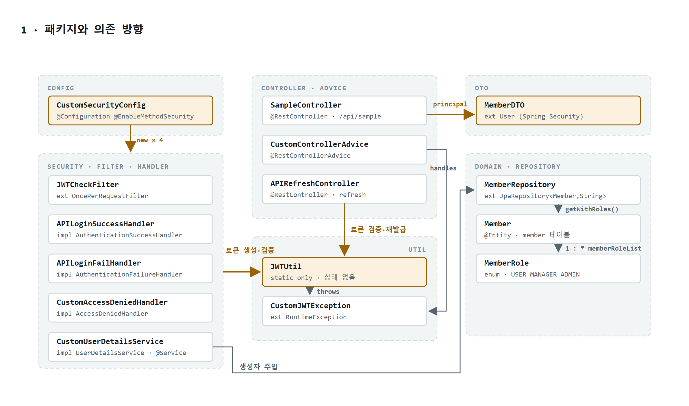
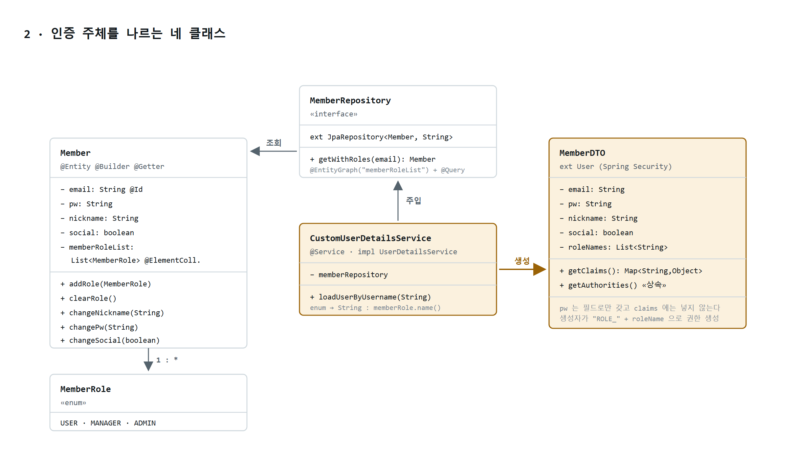
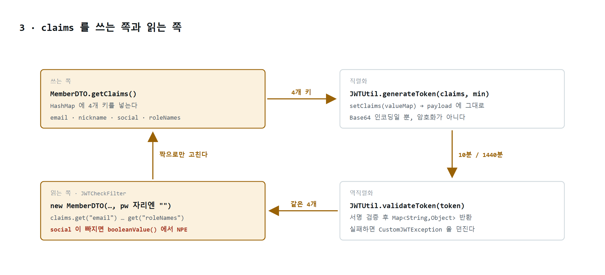
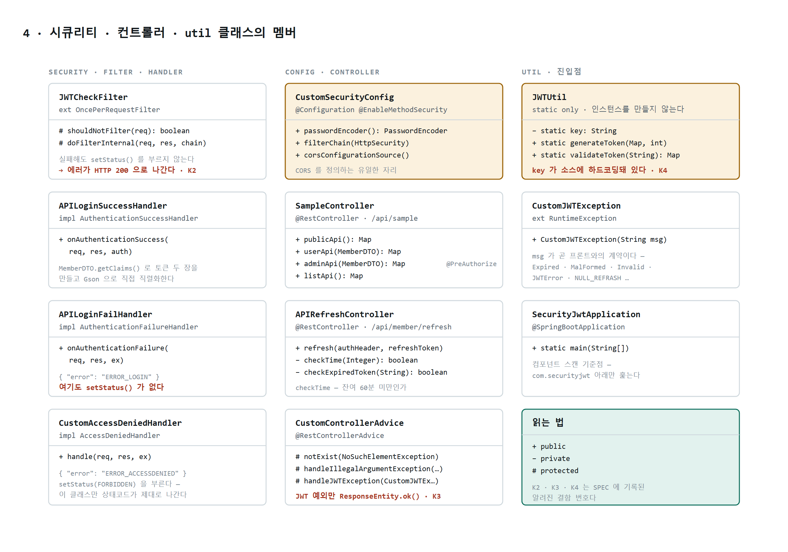

# Security-JWT-Agents

[한국어](README.md) · [English](README.en.md) · **中文**

> **认证代码往往悄无声息地出错。**
> 类型对得上、构建也能通过，却在运行时炸掉；错误以 200 返回，页面看上去一切正常。
> 本仓库要做的是**让出错的瞬间可见**，并**用工具权限强制约束修复流程**。

这是一个全栈项目：让你逐个请求地看清 **Spring Security + JWT** 的认证与授权在哪里通过、在哪里被拦下——
在浏览器中直接呈现 **HTTP 状态码与响应体原文**。
同时提供一条规范驱动（spec-driven）的智能体流水线，使这些认证代码只能按
**规范 → 设计 → 任务顺序 → 实现** 的次序修改。

### 本仓库包含什么

- **逐关卡复现失败的验证界面** —— 无令牌、伪造令牌、强制过期、权限不足、刷新，共 **10 个场景**，
  每个一个按钮；每次请求的状态码与响应体都会累积在日志区。
- **规范先于代码的结构** —— 功能规范 `F1~F8`、错误码契约、已知缺陷 `K1~K8` 全部记录在**三份基准文档**中。
  智能体只依据这些文档与 `文件:行号` 作出判断，不做猜测。
- **由权限强制的四阶段流水线** —— 负责设计的智能体**根本没有写入工具**。
  设计阶段动代码这件事，不是靠自觉约束，而是在结构上被堵死。
- **确实用这套流程修复过的记录** —— `K1`（NPE 导致日志中原因被掩盖）与 `K2`·`K3`（认证失败却返回 200）
  均通过本流水线修复，并**同时用单元测试与真实服务器响应双重验证**。剩余缺陷也如实公开。

> **这里说的 Agents 是指 ——** 定义在 `.claude/agents/` 中的**一套可复用的规则集**。
> 把本仓库取走，**规则（智能体）· 规范（docs）· 代码**会作为一整套跟着走；
> 一行 `/sjwt` 就能把一个 Security+JWT 功能从规范一路带到实现与验证。
> _（部署出去的应用本身并不包含 AI —— `build.gradle` 中没有任何 AI 依赖。）_

|              |                                                                |
| ------------ | -------------------------------------------------------------- |
| **前端**     | React 19 · TypeScript 6 · Vite 8                               |
| **后端**     | Java 21 · Spring Boot 3.5.15 · Spring Security 6 · jjwt 0.11.5 |
| **数据**     | Spring Data JPA · MariaDB                                      |
| **智能体**   | 4 个 Claude Code 子智能体 + 一个斜杠命令                       |

---

## Result Image

从登录到强制令牌过期与刷新，共十种行为，各自对应一个按钮。
每次请求的 **HTTP 状态码与响应体原文**都会原样堆叠在日志区。


| #   | 操作                             | 预期结果                                              |
| --- | -------------------------------- | ----------------------------------------------------- |
| 1   | 登录                             | 200 · 签发 accessToken 与 refreshToken，显示载荷与剩余时间 |
| 2   | 用错误密码登录                   | **401** `ERROR_LOGIN`                                 |
| 3   | 调用受保护 API（带令牌）         | 200 · 返回列表                                        |
| 4   | 调用受保护 API（无令牌）         | **401** `ERROR_ACCESS_TOKEN`                          |
| 5   | 用伪造令牌调用                   | **401** `ERROR_ACCESS_TOKEN`                          |
| 6   | 调用 ADMIN 专用 API              | USER 账号会得到 **403** `ERROR_ACCESSDENIED`          |
| 7   | 调用 refresh（令牌仍有效）       | 200 · 原样返回同一对令牌                              |
| 8   | 强制 accessToken 过期 → 调用 API | **401** `ERROR_ACCESS_TOKEN`                          |
| 9   | 接着调用 refresh                 | 200 · 签发新的 accessToken                            |
| 10  | 不带 refreshToken 调用 refresh   | 参数缺失 → **400** ※                                  |

> ※ `docs/1-SPEC.md` 的 F5 写明这种情况会返回 `NULL_REFRASH`，实际并非如此。
> `APIRefreshController` 中的 `@RequestParam("refreshToken")` 默认是必填的，因此在进入方法之前
> Spring 就会抛出 `MissingServletRequestParameterException`。控制器内部的 `null` 检查是**不可达代码**。
> `@RequestHeader("Authorization")` 同理：请求头完全缺失时得到的是 400，而不是 `INVALID_STRING`。
> **这是向运行中的服务器发送真实请求后确认的结果。** 要么让文档贴合实际行为，要么改成 `required = false` ——
> 无论选哪条路，本项目的规矩都是先修规范。

前端依据**响应体中的 `error` 字符串**而非状态码来分支。因为同一个 401 里会同时出现
`ERROR_LOGIN` · `ERROR_ACCESS_TOKEN` · `Expired` · `INVALID_STRING`，
仅凭状态码无法判断请求是被哪一道关卡拦下的。

---

## 目录结构

```
security-jwt-agents/
├── securityJWT/          # 后端 —— Spring Boot (:8080)，Gradle 项目根目录
│   ├── .claude/agents/   #   ← 四阶段流水线的智能体
│   ├── docs/             #   ← 智能体据以判断的基准文档
│   └── src/main/java/com/securityjwt/
└── front-sjwt/           # 前端 —— Vite + React + TS (:5173)，仅用于验证
```

两个项目是**有意分开的**。只有源（origin）不同，CORS 与 preflight 才会真正发生，
也才能确认认证是否真的生效。这正是不使用 Vite proxy 的原因。

---

## 运行方式

需要两个终端，并且 MariaDB 必须已经启动。

```bash
# 0) 准备数据库（仅一次）—— 在 MariaDB 中执行 securityJWT/db/schema.sql

# 1) 创建测试账号（仅一次）
cd securityJWT
./gradlew.bat test --tests "com.securityjwt.repository.MemberRepositoryTests"

# 2) 后端 —— http://localhost:8080
./gradlew.bat bootRun

# 3) 前端（另一个终端）—— http://localhost:5173
cd front-sjwt
npm install
npm run dev
```

测试账号 `user1@aaa.com` / `1111` —— 数据库中**必须以 BCrypt 哈希形式保存**。存明文的话永远只会得到 `ERROR_LOGIN`。

无需数据库即可运行的测试：

```bash
./gradlew.bat test --tests "com.securityjwt.util.JWTUtilTests" --tests "com.securityjwt.security.filter.JWTCheckFilterTests"
```

---

## Agents

认证代码只要改错一处就会悄悄出问题，因为其中存在**编译器无法校验的耦合**——
比如写入 `claims` 的一侧与读取 `claims` 的一侧。
因此这里不直接改代码，而是走四个阶段。

```
SPEC  ──→  PLAN  ──→  TASKS  ──→  IMPLEMENT
做什么？     怎么做？     按什么顺序？    落到代码
```

### 各阶段的智能体

| 阶段          | 智能体       | 工具权限                 | 产出                       | 基准文档         |
| ------------- | ------------ | ------------------------ | -------------------------- | ---------------- |
| 1 · SPEC      | `sjwt-spec`  | `Read` `Glob` `Grep`     | 需求规范、契约影响分析     | `docs/1-SPEC.md` |
| 2 · PLAN      | `sjwt-plan`  | + `Bash`（仅用于查询）   | 技术选型、设计决策、风险点 | `docs/2-PLAN.md` |
| 3 · TASKS     | `sjwt-tasks` | `Read` `Glob` `Grep`     | 按依赖顺序拆分的任务清单   | `docs/1-SPEC.md` |
| 4 · IMPLEMENT | `sjwt-impl`  | + `Write` `Edit` `Bash`  | 代码 + 测试 + 验证结果     | `docs/3-TEST.md` |

**关键在于各阶段的权限不同。** 第 1～3 阶段根本没有写入工具，
所以在设计过程中动代码这件事在结构上就不可能发生。只有 `sjwt-impl` 会修改文件。

### 为什么这样做

这并不是新发明的流程。**先写设计文档、达成一致，然后再写代码**本就是由来已久的标准做法；
这里所做的，只是把每个阶段从依靠人的自律，改为依靠**智能体的工具权限**来强制执行。
在 LLM 编码工具领域，同样的方向正以 *spec-driven development* 之名逐渐确立 ——
AWS Kiro、GitHub Spec Kit 等都在解决同一个问题。

这套做法对认证代码格外划算，原因有两点。

- **存在编译器抓不到的耦合。** 写入 `claims` 的一侧（`MemberDTO.getClaims()`）与读取的一侧
  （`JWTCheckFilter`）仅靠字符串键相连，只改一边的话构建照样通过，却会在运行时炸掉。
  `docs/1-SPEC.md` 明确记录了这对搭配，因此会在 SPEC 阶段被拦住。
- **错误字符串本身就是 API 契约。** 只要改动一个 `ERROR_ACCESS_TOKEN`，前端的分支就会悄然失效。
  SPEC 阶段会先判定契约影响，一旦有会被破坏的项目就在那里停下。

### 使用方法

```
/sjwt 想在登录响应中加入会员注册日期
/sjwt 让令牌过期时返回 401 状态码
```

每完成一个阶段就展示结果，**得到批准后**才进入下一步。绝不会把四个阶段一口气跑完。
也可以直接单独调用某一阶段 —— *"用 sjwt-spec 智能体先把需求梳理出来"*。

### 智能体遵守的规则

- **不做猜测。** 必须读取真实文件，并以 `文件:行号` 为依据描述当前行为。
- **错误字符串与响应字段名是与前端的契约。**（`ERROR_LOGIN`、`ERROR_ACCESS_TOKEN`、
  `ERROR_ACCESSDENIED`、`NULL_REFRASH` 等）修改须经用户批准，新增则自由。
- **已知缺陷（`K1~K8`）只能提出建议。** 未经批准不得修复，也不得擅自扩大范围。
- **不掩盖失败。** 测试挂了就原样贴出输出。若因没有数据库而无法运行 `@SpringBootTest`，
  就不能说"通过了"。

### 基准文档

智能体只依据这三份文档作判断。**规范变了，先改文档再改代码。**

| 文档                                           | 内容                                              |
| ---------------------------------------------- | ------------------------------------------------- |
| [`docs/1-SPEC.md`](securityJWT/docs/1-SPEC.md) | 功能规范 `F1~F8`、错误码契约、已知缺陷 `K1~K8`    |
| [`docs/2-PLAN.md`](securityJWT/docs/2-PLAN.md) | 可用技术、禁用 API、请求处理流程                  |
| [`docs/3-TEST.md`](securityJWT/docs/3-TEST.md) | 测试代码模板、回归检查清单                        |

### 迁移到其他项目

这些智能体**不适合在空文件夹里从零生成项目**，因为 `sjwt-spec` 的前提是
*"不做猜测；必须读取真实文件、确认当前行为后再描述"*。
正确的做法是**以本仓库为起点**——代码、规范、规则会作为一整套跟着走——再在此基础上生长。

**1. 取得仓库**

```bash
git clone https://github.com/excelh11/security-jwt-agents.git my-auth
cd my-auth
```

**2. 修改包名** —— 把 `com.securityjwt` 改成你想要的名字。三处必须一起改。

```
src/main/java/com/securityjwt/     目录名
src/test/java/com/securityjwt/     目录名
*.java 中的 package · import 声明
docs/*.md · CLAUDE.md 中的路径表述
```

**3. 填写数据库配置**

```bash
cd securityJWT/src/main/resources
cp application.properties.example application.properties   # 填入具体值
```

**4. 先从 `docs/1-SPEC.md` 改起。** 规范先于代码。
删掉不需要的功能（`F1~F8`），把新需要的东西写成需求。智能体正是依据这份文档作判断。

**5. 用 `/sjwt` 添加功能**

```
/sjwt 让社交登录签发的令牌也走同一个过滤器
```

> ⚠️ **智能体定义位于 `securityJWT/.claude/`。** 必须在 **`securityJWT` 目录下**启动 Claude Code，
> 而不是在仓库根目录，`/sjwt` 与子智能体才会被识别。

---

## Class diagrams

### 1 · 包结构与依赖方向

16 个类如何分布在六个包中，以及依赖只朝哪一个方向流动。



### 2 · 承载认证主体的四个类

数据库中的 `Member` 与 Spring Security 所理解的 `MemberDTO` 字段几乎相同，却是不同的类型。
把二者连起来的唯一位置是 `CustomUserDetailsService.loadUserByUsername()`。



### 3 · 写入 claims 的一侧与读取的一侧

`MemberDTO` 把自身字段摊平成 `Map` 装进令牌，`JWTCheckFilter` 再从那个 `Map` 中逐个取出键重新组装。
**二者仅靠字符串相连，因此只改一边的话编译照样通过，却会在运行时炸掉。**



### 4 · security · controller · util 各类的成员



---

## 后端代码的已知缺陷

缺陷不做隐藏，全部以 `K1~K8` 记录在 `docs/1-SPEC.md` 中。智能体**未经批准不得修复**这些项目 ——
目的正是留下"明知存在却有意保留"的记录。

### 尚未处理

| #           | 内容                                                  | 性质                                                                        |
| ----------- | ----------------------------------------------------- | --------------------------------------------------------------------------- |
| **K4**      | JWT 签名密钥硬编码在 `JWTUtil.java` 中。              | ⚪ 有意为之的**公开示例密钥**。正式服务中必须移到环境变量。                  |
| **K8**      | `checkExpiredToken()` 只把 `"Expired"` 当作过期。     | 🟡 格式损坏的令牌会被判定为"仍然有效"，于是原样把收到的令牌退回去。          |
| **K6 · K7** | 使用 jjwt 0.11.5 的废弃 API · 没有 URL 级别的授权     | ⚪ 在当前技术栈下不影响行为                                                  |

### 已解决 —— 全部通过这条流水线修复

| #      | 内容                                                            | 处理方式                                                         |
| ------ | --------------------------------------------------------------- | ---------------------------------------------------------------- |
| **K1** | 请求头为 `null` 时在 `substring(7)` 处 NPE → catch 吞掉了原因   | 在校验之前先确认 `Bearer ` 前缀，并用 `log.warn` 记录原因         |
| **K2** | 认证失败未调用 `setStatus()`，以 HTTP 200 返回                  | `JWTCheckFilter` · `APILoginFailHandler` 均返回 **401**           |
| **K3** | `ResponseEntity.ok()` —— JWT 异常同样返回 200                   | 改为 `ResponseEntity.status(UNAUTHORIZED)` —— **401**             |
| **K5** | `pw`（BCrypt 哈希）混进 JWT claims，在载荷中可被直接读出        | 从 claims 中移除 · credentials 置为 `null` —— 伴随 **F1 响应契约变更** |

由于 K5 是**会改变响应契约的变更**，先修改了 `docs/1-SPEC.md` 的 F1，
再把 `MemberDTO.getClaims()`（写入侧）与 `JWTCheckFilter`（读取侧）一并修改，
并同步调整了前端的 `types.ts`。为防止回归，还追加了
**解码已签发令牌的载荷、断言其中不含哈希**的测试。

`application.properties` 中的数据库连接信息**仅用于本地开发**，不会提交到仓库。

---

## 许可证

[MIT](LICENSE)
